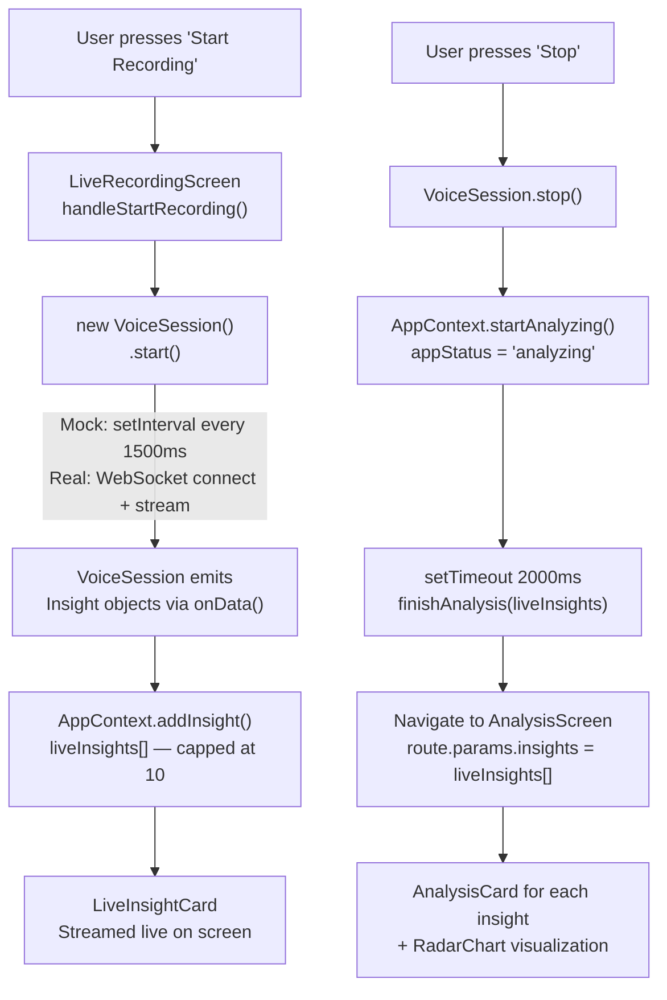
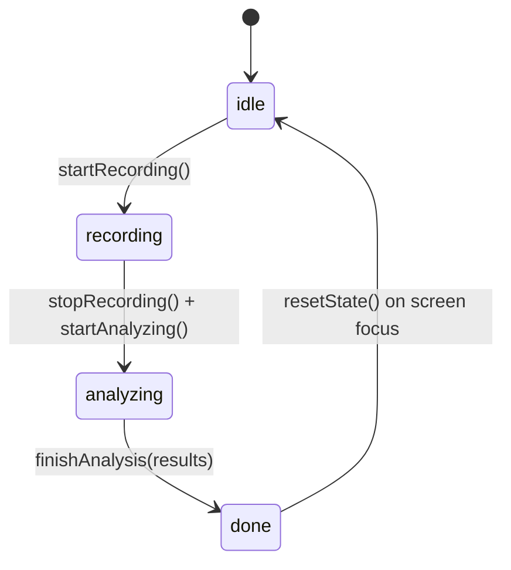

# API Flow & Backend Integration Analysis
## Voice Insights — React Native App

---

## 1. Current State (Mock) vs Real Backend

The app is **fully built around a mock**, but the architecture has a **single clean seam** for swapping in a real backend: the [VoiceSession](file:///c:/Users/Venkataraman%20P/Documents/Code/react-native/src/sessions/VoiceSession.js#28-70) class in [src/sessions/VoiceSession.js](file:///c:/Users/Venkataraman%20P/Documents/Code/react-native/src/sessions/VoiceSession.js).

> [!IMPORTANT]
> The **only file you need to replace** to connect a real backend is [VoiceSession.js](file:///c:/Users/Venkataraman%20P/Documents/Code/react-native/src/sessions/VoiceSession.js). Everything else in the app — screens, context, components — is backend-agnostic.

---

## 2. End-to-End Data Flow



---

## 3. The Insight Object — Backend Contract

This is the **single data type** the backend must produce. Every message from the backend must conform to this shape:

```javascript
{
  speech:    string,   // Transcribed text, e.g. "Hello, how are you?"
  speaker:   string,   // Speaker ID/label, e.g. "Speaker 1"
  soundType: string,   // Enum: "speech" | "music" | "noise"
  distance:  string,   // Enum: "near" | "far"
  loudness:  string,   // Enum: "loud" | "moderate" | "quiet"
  timestamp: number    // Unix ms, e.g. Date.now()
}
```

> [!WARNING]
> The frontend currently has **no error handling** for missing or malformed fields. The backend MUST always send all 6 fields. Unexpected `soundType`, `distance`, or `loudness` values will fall through to a score of `50` in the mapper — no crash, but bad chart data.

---

## 4. App Status State Machine



| Status | Meaning |
|--------|---------|
| `idle` | Initial / reset state |
| `recording` | VoiceSession active, streaming insights |
| `analyzing` | Session stopped, 2s fake processing delay |
| `done` | Analysis complete, AnalysisScreen shown |

---

## 5. How [VoiceSession](file:///c:/Users/Venkataraman%20P/Documents/Code/react-native/src/sessions/VoiceSession.js#28-70) Is Used (The Integration Contract)

[LiveRecordingScreen](file:///c:/Users/Venkataraman%20P/Documents/Code/react-native/src/screens/LiveRecordingScreen.js#17-149) interacts with [VoiceSession](file:///c:/Users/Venkataraman%20P/Documents/Code/react-native/src/sessions/VoiceSession.js#28-70) using only **4 methods**:

```javascript
const session = new VoiceSession();

// Register listener BEFORE starting
session.onData((insight) => {
  addInsight(insight);  // pushed to AppContext
});

session.start();    // Called on "Start Recording" press
session.stop();     // Called on "Stop" press
session.destroy();  // Called on component unmount cleanup
```

No other screen or component touches [VoiceSession](file:///c:/Users/Venkataraman%20P/Documents/Code/react-native/src/sessions/VoiceSession.js#28-70) directly.

---

## 6. Score Mapping (How Strings Become Chart Numbers)

The radar chart in [AnalysisCard](file:///c:/Users/Venkataraman%20P/Documents/Code/react-native/src/components/AnalysisCard.js#7-55) needs numbers (0–100). [scoreMapper.js](file:///c:/Users/Venkataraman%20P/Documents/Code/react-native/src/utils/scoreMapper.js) converts the categorical backend values:

| Field | Value | Score |
|-------|-------|-------|
| `loudness` | `"loud"` | 90 |
| `loudness` | `"moderate"` | 55 |
| `loudness` | `"quiet"` | 20 |
| `distance` | `"near"` | 80 |
| `distance` | `"far"` | 30 |
| `soundType` | `"speech"` | 85 (Activity axis) |
| `soundType` | `"music"` | 70 |
| `soundType` | `"noise"` | 40 |
| `Confidence` | *(fixed)* | 65 |
| `Clarity` | *(fixed)* | 75 |

> [!NOTE]
> `Confidence` and `Clarity` are hardcoded constants — the backend does **not** currently send them. These are placeholders that your real backend could supply in future iterations.

---

## 7. What the Backend Must Implement

### 7.1 WebSocket Endpoint (Recommended Protocol)

The backend should expose a **WebSocket endpoint** (e.g. `ws://your-server/ws/voice`). The [VoiceSession](file:///c:/Users/Venkataraman%20P/Documents/Code/react-native/src/sessions/VoiceSession.js#28-70) class should be rewritten to:

1. Connect on [start()](file:///c:/Users/Venkataraman%20P/Documents/Code/react-native/src/sessions/VoiceSession.js#35-48)
2. Stream Insight JSON messages to the client in real-time
3. Disconnect cleanly on [stop()](file:///c:/Users/Venkataraman%20P/Documents/Code/react-native/src/sessions/VoiceSession.js#49-56) / [destroy()](file:///c:/Users/Venkataraman%20P/Documents/Code/react-native/src/sessions/VoiceSession.js#65-69)

**Message format** (backend → app, per audio segment):
```json
{
  "speech": "Hello, how are you?",
  "speaker": "Speaker 1",
  "soundType": "speech",
  "distance": "near",
  "loudness": "loud",
  "timestamp": 1710000000000
}
```

### 7.2 Audio Input from the Device

Currently, [VoiceSession](file:///c:/Users/Venkataraman%20P/Documents/Code/react-native/src/sessions/VoiceSession.js#28-70) sends **no audio** to any server (it's pure mock). The real backend integration must also handle capturing and sending audio. Two common approaches:

| Approach | Description |
|----------|-------------|
| **WebSocket binary frames** | Stream raw PCM / compressed audio over the same WebSocket connection |
| **HTTP chunked upload** | POST audio chunks to a REST endpoint, receive Insight responses |

> [!IMPORTANT]
> The Expo app has `expo-av` installed for audio recording. You'll need to wire `Audio.Recording` from `expo-av` into the new [VoiceSession](file:///c:/Users/Venkataraman%20P/Documents/Code/react-native/src/sessions/VoiceSession.js#28-70) to capture device mic data and stream it to the backend.

### 7.3 Minimum Backend API Surface

| Endpoint | Protocol | Direction | Purpose |
|----------|---------|-----------|---------|
| `/ws/voice` | WebSocket | Bidirectional | Audio upload + Insight stream |
| *(optional)* `/api/analyze` | REST POST | Request/Response | Batch analysis of a full session |

### 7.4 Analysis Step

Currently, "analysis" is a **fake 2-second delay** using the same live insights:
```javascript
// LiveRecordingScreen.js line 81-84
setTimeout(() => {
  finishAnalysis([...liveInsights]);  // just re-uses live data
  navigation.navigate('AnalysisScreen', { insights: [...liveInsights] });
}, 2000);
```

A real backend should receive all collected insights (or the full audio) and return a **curated/processed list** of analysis results. The contract is the same Insight array, but computed server-side.

---

## 8. Data Flow Summary Table

| Layer | File | Role |
|-------|------|------|
| Session / Transport | [VoiceSession.js](file:///c:/Users/Venkataraman%20P/Documents/Code/react-native/src/sessions/VoiceSession.js) | ⚠️ Replace this with real WebSocket |
| Global State | [AppContext.js](file:///c:/Users/Venkataraman%20P/Documents/Code/react-native/src/context/AppContext.js) | Holds insights, status — no changes needed |
| Recording UI | [LiveRecordingScreen.js](file:///c:/Users/Venkataraman%20P/Documents/Code/react-native/src/screens/LiveRecordingScreen.js) | Starts/stops session, drives state — no changes needed |
| Analysis UI | [AnalysisScreen.js](file:///c:/Users/Venkataraman%20P/Documents/Code/react-native/src/screens/AnalysisScreen.js) | Reads `route.params.insights` — no changes needed |
| Card Display | [AnalysisCard.js](file:///c:/Users/Venkataraman%20P/Documents/Code/react-native/src/components/AnalysisCard.js) | Renders one Insight — no changes needed |
| Score Conversion | [scoreMapper.js](file:///c:/Users/Venkataraman%20P/Documents/Code/react-native/src/utils/scoreMapper.js) | Maps strings → chart numbers — may extend for new fields |

---

## 9. Steps to Connect a Real Backend

1. **Rewrite [VoiceSession.js](file:///c:/Users/Venkataraman%20P/Documents/Code/react-native/src/sessions/VoiceSession.js)** to open a WebSocket, capture mic via `expo-av`, send audio bytes, and call `this.dataCallback(insight)` for each parsed Insight JSON received.
2. **Keep the same public interface**: [start()](file:///c:/Users/Venkataraman%20P/Documents/Code/react-native/src/sessions/VoiceSession.js#35-48), [stop()](file:///c:/Users/Venkataraman%20P/Documents/Code/react-native/src/sessions/VoiceSession.js#49-56), [onData(cb)](file:///c:/Users/Venkataraman%20P/Documents/Code/react-native/src/sessions/VoiceSession.js#57-60), [destroy()](file:///c:/Users/Venkataraman%20P/Documents/Code/react-native/src/sessions/VoiceSession.js#65-69).
3. **Build backend** delivering the Insight JSON contract above over WebSocket.
4. *(Optional)* Replace the `setTimeout` fake analysis delay in [LiveRecordingScreen.js](file:///c:/Users/Venkataraman%20P/Documents/Code/react-native/src/screens/LiveRecordingScreen.js) with a real `/api/analyze` POST call, then pass the response to `finishAnalysis()`.
5. *(Optional)* Add `confidence` and `clarity` fields to the Insight schema, and update [scoreMapper.js](file:///c:/Users/Venkataraman%20P/Documents/Code/react-native/src/utils/scoreMapper.js) to use them instead of hardcoded 65/75.
